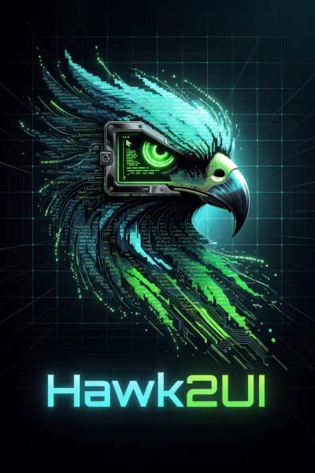

<table>
<tr>
<td width="400">

</td>
<td valign="top">

# Hawk2UI

**Build desktop apps and audio-plugin editors with TypeScript, CSS, and a manifest.**
**No Chromium. No WebView. No JUCE. No Rust required.**

Hawk2UI compiles familiar web authoring primitives into a signed native artifact, rendered by a pure-Rust engine — for both standalone desktop windows and editors embedded inside a DAW.

[](#license)
[](https://www.rust-lang.org/)
[]()

**Native UI from web primitives — without the browser.**

</td>
</tr>
</table>

---

```bash
cargo run -p hawk2ui-cli -- new            # scaffold a project
cargo run -p hawk2ui-cli -- dev            # hot-reload the native surface
cargo run -p hawk2ui-cli -- run-desktop --presentation-backend gpu-preferred
cargo run -p hawk2ui-cli -- build-dev      # produce an unsigned local artifact

HAWK2UI_RELEASE_SIGNING_KEY_ID=local-release \
HAWK2UI_RELEASE_SIGNING_KEY_HEX=<64-hex-private-key> \
cargo run -p hawk2ui-cli -- build-release  # produce a signed release artifact
```

## How It Works

A project is driven by a canonical `hawk.json` manifest plus a framework/native entry point, CSS, scripts, and assets. Existing `manifest.hawk.toml` fixtures are legacy migration inputs while the implementation is converted. The build pipeline validates and compiles the project into a signed, schema-versioned **sealed artifact**, which a host loads and renders. One engine drives two host surfaces:

- **`desktop`** — native OS application windows (Hawk2UI owns the window lifecycle), via `winit`.
- **`plugin`** — editor surfaces embedded in a DAW-owned parent window, via `baseview`, packaged as CLAP/VST3/AU/standalone.

The native stack: `skia-safe` rendering, `taffy` flexbox/grid layout, `parley`/`swash`/`fontdb` text shaping, `boa_engine` + `oxc` for JavaScript/TypeScript, and `accesskit` accessibility. `unsafe` is forbidden workspace-wide except at the plugin window-handle FFI boundary.

## Status

Implemented against an enforced production baseline. The core engine, runtime, desktop and plugin hosts, framework adapters, and the build/CLI toolchain are in place and covered by CI (format, clippy, unit + integration + smoke tests, render benchmark, docs, dependency policy).

The baseline is stable, production-ready, and feature-complete. No MVP scope, candidate backend, partial framework compiler, placeholder runtime path, or deferred compatibility target satisfies the baseline. Any missing feature, unsupported production platform, stub, TODO, or untested integration is a release blocker until code, tests, manual coverage, and release evidence prove it complete.

## Build & Test

Cargo workspace, Rust edition 2024 (MSRV 1.95). Two gates mirror CI:

```bash
cargo run -p xtask -- check-fast   # before every commit: fmt, check, tests, contract/template filters, smoke apps
cargo run -p xtask -- check        # full gate: + clippy -D warnings, integration, bench, docs, cargo-deny
```

The `hawk2ui-cli` binary drives the authoring workflow:

```bash
cargo run -p hawk2ui-cli -- new            # scaffold a project
cargo run -p hawk2ui-cli -- dev            # watch + hot-reload the native surface
cargo run -p hawk2ui-cli -- run-desktop --presentation-backend gpu-preferred
cargo run -p hawk2ui-cli -- build-dev      # produce an unsigned local artifact
HAWK2UI_RELEASE_SIGNING_KEY_ID=local-release \
HAWK2UI_RELEASE_SIGNING_KEY_HEX=<64-hex-private-key> \
cargo run -p hawk2ui-cli -- build-release  # produce a signed release artifact
HAWK2UI_TRUSTED_RELEASE_KEYS=local-release:<64-hex-public-key> \
cargo run -p hawk2ui-cli -- verify-artifact # verify release trust
HAWK2UI_RELEASE_SIGNING_KEY_ID=local-release \
HAWK2UI_RELEASE_SIGNING_KEY_HEX=<64-hex-private-key> \
cargo run -p hawk2ui-cli -- package-plugin # CLAP / VST3 / AU / standalone
```

See `examples/` for working `manifest.hawk.toml` layouts (`desktop-basic`, `plugin-synth-editor`), and `CLAUDE.md` for the architecture and crate layering.

## Documentation

- User-facing manual — `manual/README.md`
- Project manifest — `manual/project-manifest.md`
- Developer guide — `manual/developer-guide.md`
- API reference — `manual/api-reference.md`
- Rendering reference — `manual/rendering-reference.md`
- Packaging guide — `manual/packaging.md`

## Assets

The Hawk2UI logo assets in `assets/` were carried forward from the archived `hawk2ui-prototypes` repo and remain part of the production project identity.

## License

Dual-licensed under either [MIT](LICENSE-MIT) or [Apache-2.0](LICENSE-APACHE), at
your option — build, ship, and sell desktop apps, plugin editors, plugins, hosts,
and end-user software with no further permission or fee.

One narrow exception ([ADDITIONAL_TERMS.md](ADDITIONAL_TERMS.md)): redistributing
Hawk2UI *itself as a commercial framework* to third-party developers requires a
Framework License. Free / open-source frameworks are exempt, and ambiguities
resolve in favor of the standard grant — no other use is affected.

Unless you state otherwise, any contribution you submit for inclusion is
dual-licensed as above.

## Contact

Maintained by Shawn ([@entrepeneur4lyf](https://github.com/entrepeneur4lyf)).

- **Framework licensing & inquiries** — shawn@hawk2ui.com
- **GitHub** — [@entrepeneur4lyf](https://github.com/entrepeneur4lyf)
- **X** — [@entrepeneur4lyf](https://x.com/entrepeneur4lyf)

## Production Readiness Hardening Status

The framework is under active production hardening. The items below record the
current production-readiness evidence that is enforced by code, tests, release
checks, or source-truth conformance.

| Area | Status | Production-readiness evidence |
|---|---|---|
| Security model enforcement | Remediated | Build-release and package-plugin require Ed25519 signing, sealed release artifacts require verified signature metadata, verify-artifact runs package trust validation, CLAP runtime/Baseview plugin loaders validate artifacts against trusted release keys, and the manual documents release key management. |
| CSS accepted-subset enforcement | Remediated | Supported keywords, units, functions, grid longhands, `box-shadow`, and `transform` grammar are enforced by `hawk2ui-style`; unsupported functions and out-of-subset effect syntax are rejected before runtime lowering. |
| Smoke-test realness | Remediated | Smoke tests now require real `BuildWorkspace` script/style/target artifact evidence, production style compilation, Skia-backed software-frame pixels, Baseview rendering evidence, Winit host lifecycle events, and framework/plugin/effects domain assertions. |
| Release evidence | Remediated | `xtask` release checks now validate README/manual release claims against workspace package inventory, release criteria, package targets, evidence paths, and exact manual packaging commands. |
| Framework source fidelity | Remediated | Framework compiler artifacts now carry explicit compiler provenance (`framework`, compiler package, source path, entrypoint), Rust authoring wire validation preserves it, and framework adapters continue to reject raw source in favor of native-program lowering. |
| Effects pipeline | Remediated | Compiled styles now lower gradients, border radius, shadows, glow, opacity, and transforms into typed runtime visuals, deterministic paint commands, and Skia pixels via the production runtime-scene replay path. |
| Performance measurement | Remediated | Performance evidence now distinguishes deterministic release gates from advisory wall-clock timings; release gates use byte/count measurements for package size, memory proxy, render/runtime hot-path counts, and realtime allocation attempts, while Winit runtime summaries report last/max/average/total successful frame duration telemetry. |
| Plugin parameter fidelity | Remediated | `Choice` and `Bool` parameter defaults, pinned numeric ids, enum max ranges, host bridge/package metadata, and typed state envelopes now preserve parameter semantics across plugin metadata, host bridges, state, and package outputs. |
| VST3 implementation | Remediated | Generated VST3 scaffolds now build against the local safe binding crate, export lifecycle entry points and `GetPluginFactory`, enumerate processor/controller classes, instantiate COM-compatible processor/controller objects through `createInstance`, expose stereo bus routing, process f32/f64 passthrough audio buffers, round-trip parameter state through `IBStream`, and are compiled into host-loadable package binaries by `package-plugin`. |
| Font pipeline depth | Remediated | `hawk2ui-text` now loads app font bytes into the Parley font context, resolves fallbacks, shapes through Parley, and provides a generation-aware glyph/layout cache with hit/miss stats and explicit invalidation; runtime text draw commands preserve requested font families into Skia replay with fallback to the renderer default typeface. |
| Host surface abstraction | Remediated | `HostSurface` is now dyn-compatible, desktop and plugin adapters route through the common surface/frame-presentation boundary, and lifecycle tests prove repaint, resize, window commands, frame presentation, and teardown work through `&mut dyn HostSurface`. |
| Platform backends | Remediated | `hawk2ui-platform` now provides executable backends for scoped filesystem reads/writes, policy-approved HTTP(S) GET requests through bounded `ureq`, text clipboard storage, and declared secret-store lookup/redaction, with a deterministic static network backend for offline verification. |
| Skia CPU renderer depth | Remediated | `hawk2ui-render-skia` now has pixel-tested source-rect image drawing, nearest/linear sampling, mipmap/tile-mode controls, text highlight/stroke/underline/strikethrough/subpixel controls, SVG clip paths, explicit blend-mode rect compositing, structured effects, vector assets, and runtime-scene replay. |
| Runtime shader effects (`SkRuntimeEffect`) | Remediated | Runtime shader effects now cross the framework boundary: backend-neutral render APIs, retained runtime shader-effect visuals, runtime draw commands, authoring props, Skia replay, bounded `SkSL` compilation, typed float/int uniforms, registered image child shaders, cache stats, capability reporting, and Skia pixel tests. |
| Desktop Wayland GPU backend | Remediated | `hawk2ui-host-winit` now exposes typed software/GPU-preferred/GPU-required presentation selection, creates native Wayland EGL/Glutin surfaces, renders through Skia Ganesh GL, verifies submitted frames with readback evidence, exposes GPU frame counts in runtime summaries, and has a gated native Wayland smoke test (`HAWK2UI_NATIVE_WAYLAND_GPU_SMOKE=1`). |
| Baseview native Wayland plugin embedding | Remediated | The vendored Baseview adapter now accepts native Wayland parent handles, opens Wayland child surfaces, creates EGL/OpenGL contexts for GPU plugin editors, reports GL creation failures as hard diagnostics, accepts CLAP Wayland parent ABI calls, and has gated native software/GL Wayland smokes including resize-after-GL coverage. |
| Security evidence vocabulary | Remediated | `hawk2ui-security` remains an evidence vocabulary for decisions made by concrete validators in `hawk2ui-build`, `hawk2ui-assets`, `hawk2ui-script`, `hawk2ui-platform`, and `hawk2ui-security-model`; conformance tests require the manual to state that boundary. |

Recently closed hardening items include CLAP multi-instance state isolation,
text shaping correctness, string-snapshot testkit removal, renderer scene/text
path hardening, and conformance security fixture validation.
